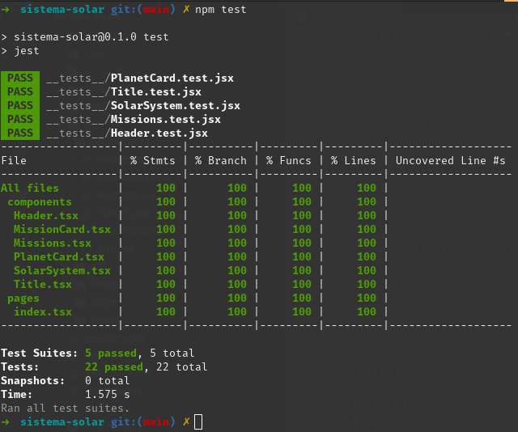

# Projeto Sistema Solar 🪐

## Descrição do projeto

Esse é um app que lista todos os planetas do sistema solar e algumas das missões de exploração espaciais mais conhecidas, feitas pela [NASA](https://www.nasa.gov/).

Nesse desafio eu pratiquei conhecimentos sobre componentização e passagem de props em React, padronização de códigos utilizando ESlint, e testes automatizados com Jest e React Testing Library para assegurar a saúde de aplicação.

## Tecnologias utilizadas no desenvolvimento

- React
- ESlint
- NextJS
- Tailwind
- Typescript
- Jest && React Testing Library 

  
Cobertura de testes 🧪

  

 

#### Como acessar

Link: https://sistema-solar-r703vwoyj-guilherme-artigas.vercel.app/
